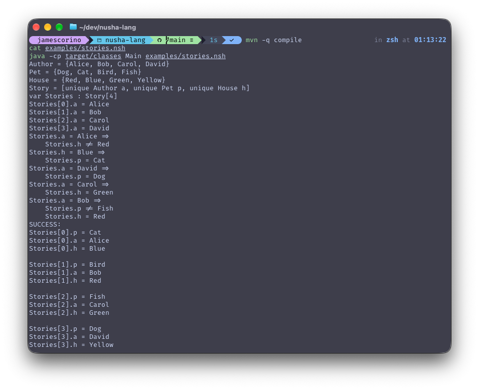

# Nusha

Nusha is a small domain-specific language where you declare typed variables and logical constraints, and the interpreter finds an assignment that satisfies all of them, or proves that none exists. Written from scratch in Java.

It suits logic puzzles well: "who lives in the red house?", "which ship is at which grid position?"

```
Source text → Lexer → Token list → Parser → AST → Interpreter/Solver → Solution
```



## Quick start

Requires Java 17 and Maven.

```bash
mvn compile
java -cp target/classes Main examples/stories.nsh
```

```
SUCCESS:
Stories[0].p = Cat     Stories[0].a = Alice   Stories[0].h = Blue
Stories[1].p = Bird    Stories[1].a = Bob     Stories[1].h = Red
Stories[2].p = Fish    Stories[2].a = Carol   Stories[2].h = Green
Stories[3].p = Dog     Stories[3].a = David   Stories[3].h = Yellow
```

### Examples

| File | What it shows |
|---|---|
| `examples/stories.nsh` | A four-author puzzle with exactly one solution |
| `examples/puzzle1.nsh` | Numeric enumeration values (`Minutes = {30, 45, 60, 90}`) |
| `examples/puzzle2-unsolvable.nsh` | Contradictory constraints; the solver reports no solution |
| `examples/puzzles.txt` | The original puzzles in English, beside their Nusha encodings |

## Language syntax

A Nusha program has three ordered sections: **Definitions**, **Variables**, and **Rules**.

### Definitions

Define enumeration types or record (struct) types.

```
Color = {Red, Blue, Green, Yellow}
Minutes = {30, 45, 60, 90}

Person = [unique Color favoriteColor, unique Pet pet]
```

- `{ ... }` is a **Choices** type, an enumeration whose values may be names or numbers
- `[ ... ]` is an **NStruct** type, a record with typed fields
- `unique` on a struct field is an all-different constraint: no two elements of the same array may share that field's value

### Variables

Declare variables with a type and an optional array size.

```
var myColor : Color
var People : Person[4]
```

### Rules

Constraints are binary expressions, in two forms.

**Simple constraint**, which must always hold:

```
People[0].favoriteColor = Red
```

**Conditional constraint**: if the left condition holds for some array element, every then-clause must also hold for that element.

```
People.favoriteColor = Blue =>
    People.pet = Cat
    People.favoriteColor != Green
```

**Operators:** `=` (equal), `!=` (not equal)

**Variable references** support dot access and array indexing:

- `varName` is a scalar variable
- `varName[i]` is element `i` of an array
- `varName.field` is field access on a scalar struct
- `varName[i].field` is field access on an array element

Indentation is significant: then-clauses are indented four spaces under their condition.

### Complete example

```
Author = {Alice, Bob, Carol, David}
Pet    = {Dog, Cat, Bird, Fish}
House  = {Red, Blue, Green, Yellow}

Story = [unique Author a, unique Pet p, unique House h]
var Stories : Story[4]

Stories[0].a = Alice
Stories[1].a = Bob
Stories[2].a = Carol
Stories[3].a = David

Stories.a = Alice =>
    Stories.h != Red
Stories.h = Blue =>
    Stories.p = Cat
Stories.a = David =>
    Stories.p = Dog
Stories.a = Carol =>
    Stories.h = Green
Stories.a = Bob =>
    Stories.p != Fish
    Stories.h = Red
```

## Architecture

| Class | Responsibility |
|---|---|
| `Main` | Command-line entry point: reads a source file, runs the pipeline, prints the solution |
| `TextManager` | Character-level cursor over the source string |
| `Lexer` | Converts source text to a `LinkedList<Token>`, tracking block structure with Python-style INDENT/DEDENT tokens off an indent stack |
| `TokenManager` | Cursor over the token list used by the parser |
| `NushaFall2025Parser` | Recursive-descent parser producing a `Nusha` AST |
| `Interpreter` | Tree-walking interpreter whose back end is the constraint solver |
| `AST/` | Plain data classes: `Nusha`, `Definitions`, `Variables`, `Rules`, `Expression`, and the rest |

### Solver

The solver runs **backtracking search with forward checking**. Each candidate assignment is tested against the all-different constraints and the program's rules, then the domains of the unassigned variables are pruned before recursing:

1. Assign a candidate value to the next unresolved variable.
2. Enforce `unique` constraints across array elements.
3. Check all current rules, short-circuiting on violation.
4. Prune candidate sets for future variables based on uniqueness.
5. Recurse, backtracking on failure.

The design decision worth pointing at: rule evaluation returns a nullable `Boolean`, where `null` means "not yet determinable." That way a partially assigned puzzle cannot falsely violate a rule referring to variables the search has not reached. Dead branches get cut, merely incomplete ones get explored.

## Building and testing

```bash
mvn compile   # compile sources
mvn test      # run the JUnit 5 suites
mvn package   # build the jar into target/
```

Sixteen JUnit tests cover the lexer and parser across four suites:

| Test file | What it covers |
|---|---|
| `Lexer1Test` | Identifiers, keywords (`var`, `unique`), numbers |
| `Lexer2Tests` | Choices, structs, indentation, operators |
| `Parser1Tests` | Variable declarations |
| `Parser2Tests` | Full programs: definitions, variables, and rules |

`InterpreterTests` is a separate runnable driver rather than a JUnit suite. It builds ASTs directly and runs the solver against eight logic puzzles (Battleship, Birthday, Cafe, Dating, Dish, Friends, Pets, Stationery), printing each solution:

```bash
mvn compile
java -cp target/classes:target/test-classes InterpreterTests
```

## Project structure

```
nusha-lang/
├── pom.xml
├── examples/
│   ├── stories.nsh
│   ├── puzzle1.nsh
│   ├── puzzle2-unsolvable.nsh
│   └── puzzles.txt
└── src/
    ├── main/java/
    │   ├── AST/                    # AST node classes
    │   ├── Main.java
    │   ├── Lexer.java
    │   ├── TextManager.java
    │   ├── TokenManager.java
    │   ├── NushaFall2025Parser.java
    │   ├── Interpreter.java
    │   └── SyntaxErrorException.java
    └── test/java/
        ├── Lexer1Test.java
        ├── Lexer2Tests.java
        ├── Parser1Tests.java
        ├── Parser2Tests.java
        └── InterpreterTests.java
```

## Notes

Built over ten weeks for a programming languages course (ICSI 311, UAlbany). The assignment supplied a 537-line skeleton: the AST node classes, the token model, and empty class shells. The lexer, parser, interpreter, and solver are what I wrote inside them, along with twelve of the sixteen JUnit tests and the example programs.